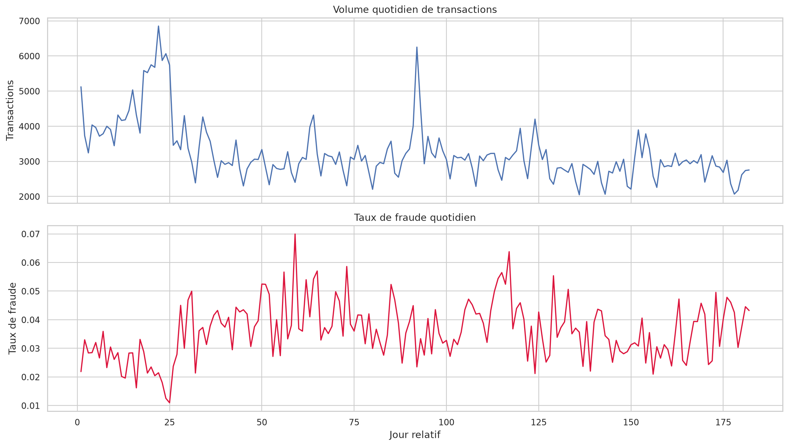
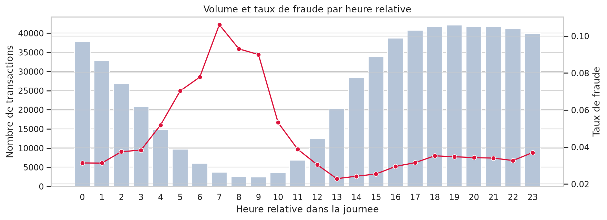
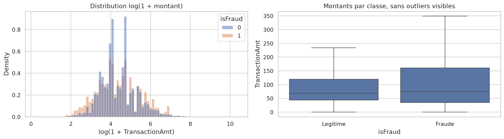
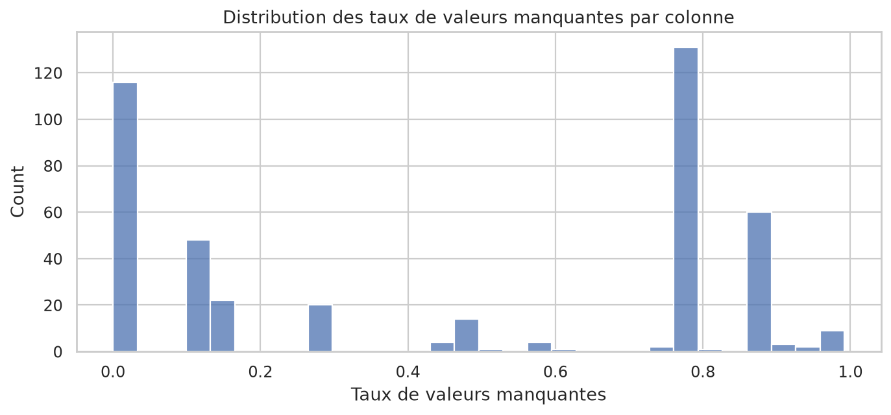
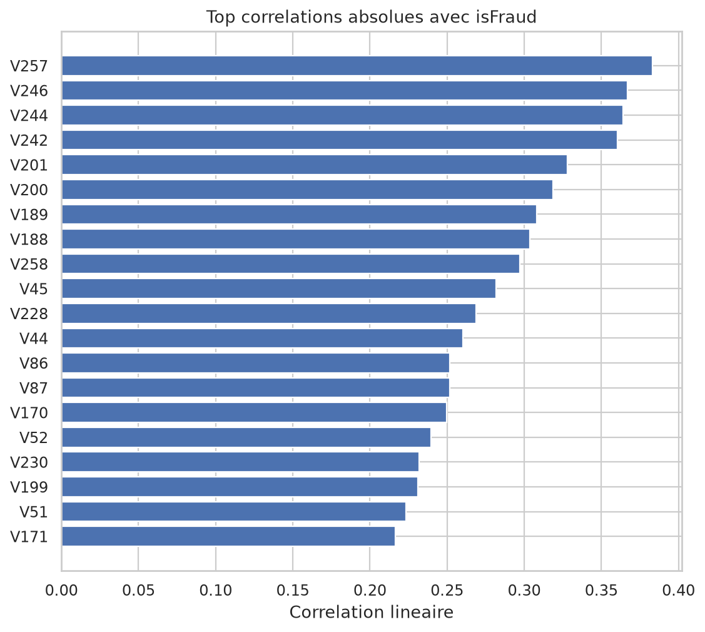
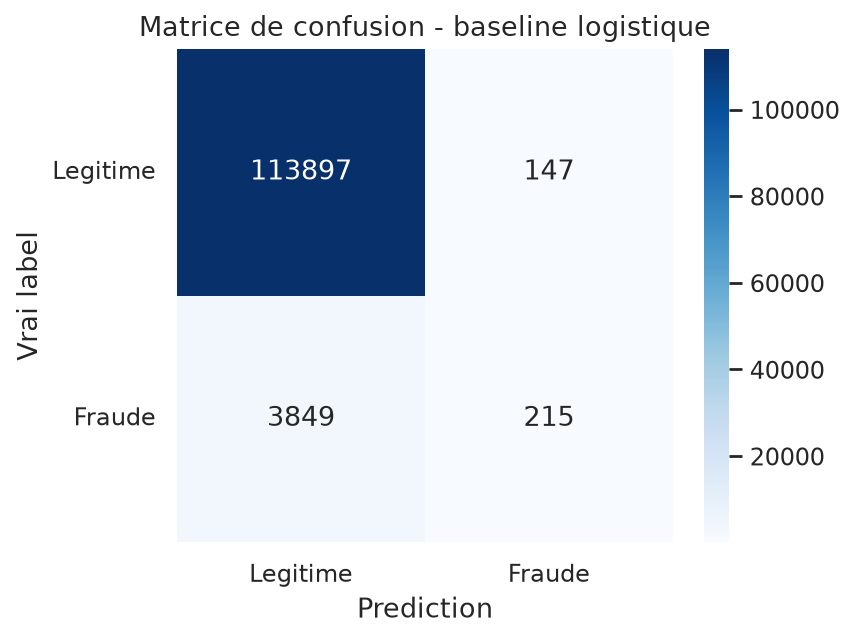
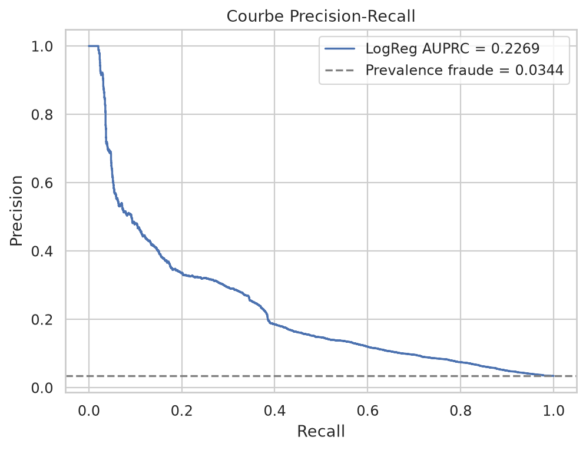
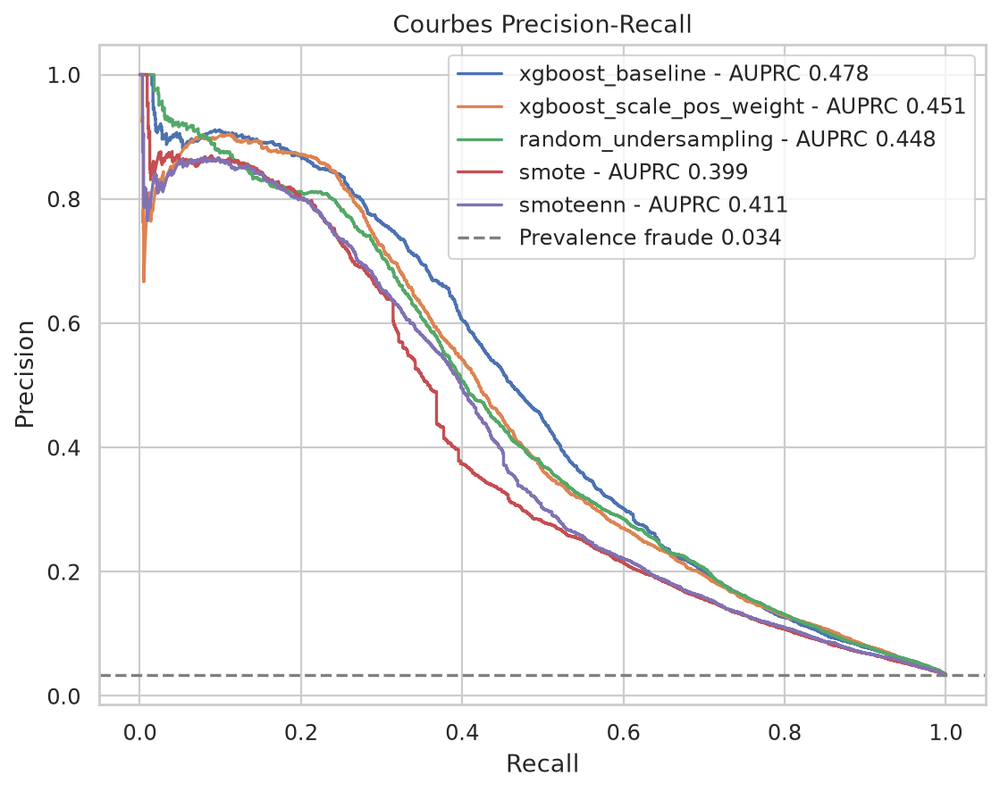
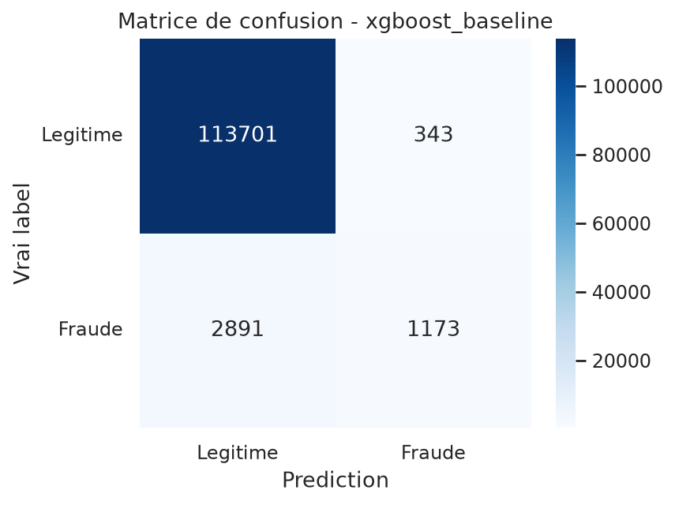
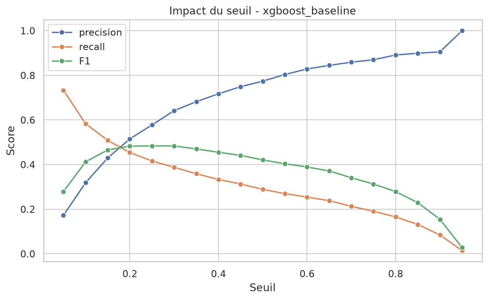

# Analyse des resultats reels - Exploration et modelisation Polars

## Contexte

Cette analyse s'appuie sur les sorties sauvegardees dans :

- `notebooks/01_exploration_polars.ipynb`
- `notebooks/02_modelling.ipynb`

Les resultats ont ete lus directement depuis les tableaux et plots des notebooks. Les images sont sauvegardees dans `docs/assets/`.

## 1. Resultats de l'exploration

### Volume et desequilibre de classes

Le dataset fusionne contient **590 540 transactions** et **434 colonnes** dans le notebook d'exploration.

| Classe | Nombre | Taux |
|---|---:|---:|
| Legitime | 569 877 | 96.50 % |
| Fraude | 20 663 | 3.50 % |

L'accuracy d'un modele qui predit toujours `legitime` est donc **96.50 %**.

Analyse : une accuracy autour de 96 % ne signifie presque rien ici, car elle peut etre obtenue sans detecter aucune fraude. Le projet doit donc etre pilote avec l'AUPRC, le recall fraude, la precision et le taux d'alertes.

Mon avis : cette partie est bien demontree. Elle donne un argument solide pour expliquer au CDO pourquoi les metriques classiques peuvent mentir dans un contexte anti-fraude.

## 2. Analyse temporelle

Le dataset couvre les jours relatifs **1 a 182**. Le split temporel utilise dans les notebooks est coherent :

| Split | Lignes | Jours | Taux fraude |
|---|---:|---|---:|
| Train | 472 432 | 1 -> 141 | 3.5135 % |
| Validation | 118 108 | 141 -> 182 | 3.4409 % |

Le taux de fraude reste proche entre train et validation, ce qui est positif pour une premiere evaluation. Il y a quand meme une variabilite journaliere visible : certains jours descendent autour de 1-2 %, tandis que d'autres montent vers 6-7 %.

Le plot horaire montre une concentration nette du risque sur certaines heures relatives :

| Heure relative | Taux de fraude approx. |
|---:|---:|
| 5 | 7.03 % |
| 6 | 7.77 % |
| 7 | 10.61 % |
| 8 | 9.30 % |
| 9 | 9.00 % |

Analyse : le comportement frauduleux n'est pas uniforme dans le temps. Les heures 5 a 9 ont un taux de fraude beaucoup plus eleve que la moyenne globale de 3.5 %. A l'inverse, les heures 13 a 15 sont plus faibles, autour de 2.3 % a 2.5 %.

Mon avis : les features temporelles sont utiles. Le split temporel est justifie, et `hour_of_day_rel`, `day_rel`, `week_rel` doivent rester dans les modeles.

## 3. Montants

| Classe | Moyenne | Mediane | P90 | P95 | P99 | Max |
|---|---:|---:|---:|---:|---:|---:|
| Legitime | 134.51 | 68.50 | 267.08 | 435.00 | 1 104.00 | 31 937.39 |
| Fraude | 149.24 | 75.00 | 335.00 | 500.00 | 994.00 | 5 191.00 |

Les fraudes ont une moyenne, une mediane, un P90 et un P95 plus eleves que les transactions legitimes. En revanche, le P99 legitime est plus eleve, probablement a cause de transactions legitimes tres grosses.

Analyse : les montants seuls ne suffisent pas a separer les classes, car les distributions se chevauchent fortement. Les ratios comportementaux, comme montant actuel / moyenne historique client, sont plus interessants que le montant brut.

## 4. Variables categorielles

Certaines categories ont des taux de fraude nettement superieurs a la moyenne.

### ProductCD

| ProductCD | Transactions | Taux fraude |
|---|---:|---:|
| C | 68 519 | 11.69 % |
| S | 11 628 | 5.90 % |
| H | 33 024 | 4.77 % |
| R | 37 699 | 3.78 % |
| W | 439 670 | 2.04 % |

`ProductCD=C` est tres au-dessus de la moyenne globale. `W`, tres majoritaire, est beaucoup moins risque.

### Type de carte

| Variable | Modalite | Taux fraude |
|---|---|---:|
| card4 | discover | 7.73 % |
| card4 | visa | 3.48 % |
| card4 | mastercard | 3.43 % |
| card6 | credit | 6.68 % |
| card6 | debit | 2.43 % |

Les cartes credit sont nettement plus risquees que les cartes debit dans ce dataset.

### Email et device

| Variable | Modalite | Taux fraude |
|---|---|---:|
| P_emaildomain | mail.com | 18.96 % |
| P_emaildomain | outlook.com | 9.46 % |
| R_emaildomain | outlook.com | 16.51 % |
| R_emaildomain | icloud.com | 12.88 % |
| R_emaildomain | gmail.com | 11.92 % |
| DeviceType | mobile | 10.17 % |
| DeviceType | desktop | 6.52 % |
| DeviceType | manquant | 2.10 % |

Analyse : les variables email et device portent un signal fort. `DeviceType=mobile` est environ trois fois plus risque que la moyenne globale. Les domaines receveurs comme `outlook.com`, `icloud.com` et `gmail.com` sont aussi tres discriminants.

Mon avis : ces variables doivent rester dans le modele, mais il faut surveiller leur stabilite en production. Les fraudeurs peuvent changer rapidement de domaine email ou de device.

## 5. Valeurs manquantes et correlations

Les valeurs manquantes sont massives pour certaines colonnes :

| Feature | Taux manquant |
|---|---:|
| id_24 | 99.20 % |
| id_25 | 99.13 % |
| id_07 | 99.13 % |
| id_08 | 99.13 % |
| dist2 | 93.63 % |
| D7 | 93.41 % |
| id_18 | 92.36 % |
| D13 | 89.51 % |

Les plus fortes correlations avec `isFraud` sont principalement des variables anonymisees `Vxxx` :

| Feature | Correlation avec isFraud |
|---|---:|
| V257 | 0.3831 |
| V246 | 0.3669 |
| V244 | 0.3641 |
| V242 | 0.3606 |
| V201 | 0.3280 |
| V200 | 0.3188 |
| V189 | 0.3082 |
| V188 | 0.3036 |

Analyse : les colonnes `Vxxx` contiennent clairement du signal predictif. Le modele compact, qui les exclut, est donc probablement sous-optimal.

Mon avis : pour eviter les problemes memoire, le mode compact est raisonnable. Mais pour viser une meilleure performance finale, il faudra reintegrer une selection limitee des meilleures `Vxxx`, par exemple les 20 a 50 variables les plus correlees ou les plus importantes selon XGBoost.

## 6. Baseline logistique de l'EDA

La regression logistique naive donne :

| Metrique | Valeur |
|---|---:|
| Accuracy | 0.9662 |
| Recall fraude | 0.0529 |
| F1 | 0.0972 |
| AUPRC | 0.2269 |

Classification report :

| Classe | Precision | Recall | F1 | Support |
|---|---:|---:|---:|---:|
| Legitime | 0.97 | 1.00 | 0.98 | 114 044 |
| Fraude | 0.59 | 0.05 | 0.10 | 4 064 |

Analyse : c'est exactement le piege attendu. L'accuracy est tres haute, mais le modele ne detecte que **5.29 % des fraudes**.

Mon avis : cette baseline est utile pedagogiquement. Elle montre que l'accuracy est inutilisable seule et justifie le passage a XGBoost.

## 7. Features temporelles 1h, 24h et 7 jours

Le notebook de modelisation contient maintenant les vraies fenetres demandees dans le sujet. Les features ajoutees sont :

| Feature | Sens |
|---|---|
| `customer_tx_count_prev_1h` | nombre de transactions du meme client dans l'heure precedente |
| `customer_amt_sum_prev_1h` | montant cumule du meme client dans l'heure precedente |
| `customer_tx_count_prev_24h` | nombre de transactions du meme client dans les 24h precedentes |
| `customer_amt_sum_prev_24h` | montant cumule du meme client dans les 24h precedentes |
| `customer_tx_count_prev_7d` | nombre de transactions du meme client dans les 7 jours precedents |
| `customer_amt_sum_prev_7d` | montant cumule du meme client dans les 7 jours precedents |

Ces features sont calculees par `customer_proxy` et utilisent uniquement les transactions precedentes. Le notebook relance confirme :

| Element | Avant | Apres fenetres |
|---|---:|---:|
| Nombre total de features | 53 | 59 |
| Dimension train | 472 432 x 53 | 472 432 x 59 |
| Dimension validation | 118 108 x 53 | 118 108 x 59 |

Analyse : les features sont correctement integrees dans le dataset de modelisation. Elles couvrent bien la demande du sujet sur les fenetres 1h, 24h et 7 jours.

Mon avis : c'est necessaire pour le cahier des charges, mais dans ce run compact elles n'ameliorent pas les performances globales. Elles peuvent quand meme devenir utiles avec un modele plus riche, plus d'arbres, ou une selection des colonnes `Vxxx`.

## 8. Resultats XGBoost et resampling apres ajout des fenetres

Le notebook modelling utilise le mode compact :

- 59 features au total ;
- 34 numeriques de base ;
- 15 categorielles ;
- 10 features comportementales et temporelles ;
- train limite a 150 000 lignes pour les strategies de resampling ;
- `scale_pos_weight = 27.46`.

### Tableau comparatif

| Strategie | AUPRC | Precision@0.5 | Recall@0.5 | F1@0.5 | Taux alertes | Temps train |
|---|---:|---:|---:|---:|---:|---:|
| xgboost_baseline | 0.4777 | 0.7737 | 0.2886 | 0.4204 | 1.28 % | 5.53 s |
| xgboost_scale_pos_weight | 0.4514 | 0.1545 | 0.7510 | 0.2563 | 16.72 % | 3.93 s |
| random_undersampling | 0.4483 | 0.1605 | 0.7517 | 0.2646 | 16.11 % | 0.74 s |
| smoteenn | 0.4112 | 0.3672 | 0.4550 | 0.4064 | 4.26 % | 104.27 s |
| smote | 0.3985 | 0.3558 | 0.4163 | 0.3837 | 4.03 % | 4.98 s |

### Lecture des resultats

Le meilleur modele en AUPRC reste **xgboost_baseline**, avec **0.4777**. C'est aussi le meilleur F1 au seuil 0.5 avec **0.4204**.

Par rapport au run precedent sans fenetres explicites, l'AUPRC de la baseline baisse legerement de **0.4827** a **0.4777**. Le recall au seuil 0.5 passe de **0.2913** a **0.2886**. L'ajout des fenetres ne produit donc pas de gain mesurable dans cette configuration compacte.

Les strategies `scale_pos_weight` et `random_undersampling` augmentent fortement le recall, autour de 75 %, mais elles declenchent environ 16 % d'alertes. C'est probablement trop eleve pour un systeme operationnel si chaque alerte doit etre traitee par un analyste.

SMOTE et SMOTEENN sont plus raisonnables en taux d'alertes, mais leur AUPRC est inferieure a la baseline. SMOTEENN reste tres couteux, avec plus de 100 secondes d'entrainement, sans gain de performance.

Mon avis : les fenetres temporelles sont importantes pour satisfaire le sujet et pour capturer la velocite transactionnelle. Mais dans les resultats actuels, elles ne suffisent pas a ameliorer XGBoost compact. Je garderais ces features, puis je testerais une version avec les meilleures colonnes `Vxxx` et un tuning XGBoost plus propre.

## 9. Meilleur modele : matrice de confusion

Le meilleur modele par AUPRC reste `xgboost_baseline`.

Matrice de confusion au seuil 0.5 :

|  | Pred legitime | Pred fraude |
|---|---:|---:|
| Vrai legitime | 113 701 | 343 |
| Vrai fraude | 2 891 | 1 173 |

Cela donne :

- vrais positifs fraude : 1 173 ;
- faux negatifs fraude : 2 891 ;
- faux positifs : 343 ;
- recall fraude : 28.86 % ;
- precision fraude : 77.37 %.

Analyse : au seuil 0.5, le modele est prudent. Quand il alerte, il se trompe peu, mais il laisse passer beaucoup de fraudes.

Mon avis : ce modele est bon comme score de risque, mais le seuil 0.5 est trop conservateur si l'objectif est de reduire fortement les chargebacks.

## 10. Analyse du seuil

Pour `xgboost_baseline`, le seuil change fortement le compromis precision / recall.

| Seuil | Precision | Recall | F1 | Taux alertes | Alertes |
|---:|---:|---:|---:|---:|---:|
| 0.05 | 0.1721 | 0.7333 | 0.2788 | 14.66 % | 17 317 |
| 0.10 | 0.3184 | 0.5832 | 0.4119 | 6.30 % | 7 443 |
| 0.15 | 0.4296 | 0.5084 | 0.4657 | 4.07 % | 4 809 |
| 0.20 | 0.5151 | 0.4537 | 0.4825 | 3.03 % | 3 580 |
| 0.25 | 0.5776 | 0.4158 | 0.4835 | 2.48 % | 2 926 |
| 0.30 | 0.6418 | 0.3875 | 0.4833 | 2.08 % | 2 454 |
| 0.50 | 0.7737 | 0.2886 | 0.4204 | 1.28 % | 1 516 |

Le F1 est maximal autour de **0.25-0.30**. Le seuil 0.25 detecte **41.58 %** des fraudes avec une precision de **57.76 %** et un taux d'alertes de **2.48 %**.

Analyse : le seuil 0.25 est un meilleur compromis que 0.5. Il augmente nettement le recall tout en gardant un volume d'alertes encore raisonnable.

Mon avis : si PayTrack a une capacite analyste suffisante, je recommanderais de demarrer autour d'un seuil **0.20 a 0.25**, pas 0.5. Si la priorite est de limiter fortement les faux positifs, alors 0.5 reste defensible mais manque trop de fraudes.

## 11. Recommandation finale

Sur les resultats actuels, je recommande :

> **XGBoost baseline compact avec features temporelles 1h/24h/7j conservees, et seuil ajuste autour de 0.20-0.25.**

Raison :

- meilleure AUPRC globale : 0.4777 ;
- meilleur F1 parmi les strategies testees au seuil 0.5 ;
- precision elevee au seuil 0.5 ;
- courbe Precision-Recall meilleure que les autres strategies sur une grande partie des recalls utiles ;
- seuil ajustable pour obtenir plus de recall sans utiliser de resampling complexe ;
- les features 1h/24h/7j repondent au cahier des charges meme si elles n'ameliorent pas encore les scores.

Je ne recommande pas `scale_pos_weight` tel quel au seuil 0.5, meme si son recall est fort, car il alerte **16.72 %** des transactions. Pour 118 108 transactions de validation, cela represente environ 19 750 alertes. C'est probablement trop pour une equipe d'analystes.

Je ne recommande pas SMOTEENN : il est lent et n'ameliore pas l'AUPRC.

## 12. Limites et ameliorations

Les resultats sont bons pour une premiere version, mais il y a quatre limites importantes.

### 1. Mode compact

Le modele exclut les colonnes `Vxxx`, alors que l'EDA montre que plusieurs d'entre elles sont fortement correlees avec la fraude. Il faut tester une version intermediaire : compact + top 30 ou top 50 `Vxxx`.

### 2. Fenetres temporelles

Les fenetres 1h/24h/7j sont maintenant implementees, mais elles n'ameliorent pas le score dans ce run. Cela peut venir de plusieurs causes :

- le `customer_proxy` est une approximation imparfaite ;
- les fenetres sont redondantes avec les compteurs `C*` ou les variables `D*` ;
- XGBoost n'est pas encore tune ;
- le mode compact retire des variables qui interagiraient avec ces fenetres.

Conclusion : il faut garder ces features pour le cahier des charges, mais ne pas les presenter comme un gain de performance tant qu'un test plus pousse ne le demontre pas.

### 3. Seuil metier

Le seuil optimal ne doit pas etre choisi uniquement par F1. Il doit dependre :

- du cout moyen d'un faux negatif ;
- du cout d'un faux positif ;
- de la capacite journaliere des analystes ;
- du niveau de friction client acceptable.

### 4. Identifiant client approximatif

Le `customer_proxy` n'est pas un vrai identifiant client. Les features de velocite sont donc utiles pour le POC, mais il faudra un vrai identifiant client ou compte en production.

## 13. Conclusion CDO

Le modele ML fait mieux qu'une baseline naive : la regression logistique avait une AUPRC de **0.2269**, alors que XGBoost baseline atteint **0.4777** avec les features temporelles 1h/24h/7j.

Le modele XGBoost baseline est le meilleur candidat actuel. Il ne faut cependant pas le deployer avec le seuil par defaut 0.5 sans discussion metier. Le seuil **0.20-0.25** semble plus pertinent si PayTrack veut detecter davantage de fraudes tout en gardant un taux d'alertes raisonnable.

La prochaine etape doit etre :

1. tester XGBoost avec une selection de colonnes `Vxxx` ;
2. ajouter SHAP pour expliquer les decisions ;
3. logger les runs dans MLflow ;
4. surveiller drift et degradation via Evidently ;
5. definir un seuil d'alerte avec les contraintes operationnelles de PayTrack.
