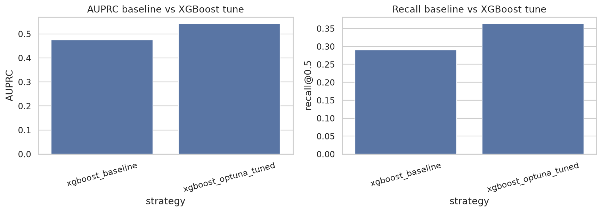

# Analyse des resultats reels - Exploration et modelisation Polars

## Contexte

Cette analyse s'appuie sur les sorties sauvegardees dans :

- `notebooks/01_exploration_polars.ipynb`
- `notebooks/02_modelling.ipynb`

Les resultats ont ete lus directement depuis les tableaux et plots des notebooks. Les images sont sauvegardees dans `docs/assets/`.

## 1. Resultats de l'exploration

### Volume et desequilibre de classes

Le dataset fusionne contient **590 540 transactions** et **434 colonnes** dans le notebook d'exploration.

| Classe | Nombre | Taux |
|---|---:|---:|
| Legitime | 569 877 | 96.50 % |
| Fraude | 20 663 | 3.50 % |

L'accuracy d'un modele qui predit toujours `legitime` est donc **96.50 %**.


Analyse : une accuracy autour de 96 % ne signifie presque rien ici, car elle peut etre obtenue sans detecter aucune fraude. Le projet doit donc etre pilote avec l'AUPRC, le recall fraude, la precision et le taux d'alertes.

Mon avis : cette partie est bien demontree. Elle donne un argument solide pour expliquer au CDO pourquoi les metriques classiques peuvent mentir dans un contexte anti-fraude.

## 2. Analyse temporelle

Le dataset couvre les jours relatifs **1 a 182**. Le split temporel utilise dans les notebooks est coherent :

| Split | Lignes | Jours | Taux fraude |
|---|---:|---|---:|
| Train | 472 432 | 1 -> 141 | 3.5135 % |
| Validation | 118 108 | 141 -> 182 | 3.4409 % |

Le taux de fraude reste proche entre train et validation, ce qui est positif pour une premiere evaluation. Il y a quand meme une variabilite journaliere visible : certains jours descendent autour de 1-2 %, tandis que d'autres montent vers 6-7 %.


Le plot horaire montre une concentration nette du risque sur certaines heures relatives :

| Heure relative | Taux de fraude approx. |
|---:|---:|
| 5 | 7.03 % |
| 6 | 7.77 % |
| 7 | 10.61 % |
| 8 | 9.30 % |
| 9 | 9.00 % |


Analyse : le comportement frauduleux n'est pas uniforme dans le temps. Les heures 5 a 9 ont un taux de fraude beaucoup plus eleve que la moyenne globale de 3.5 %. A l'inverse, les heures 13 a 15 sont plus faibles, autour de 2.3 % a 2.5 %.

Mon avis : les features temporelles sont utiles. Le split temporel est justifie, et `hour_of_day_rel`, `day_rel`, `week_rel` doivent rester dans les modeles.

## 3. Montants

| Classe | Moyenne | Mediane | P90 | P95 | P99 | Max |
|---|---:|---:|---:|---:|---:|---:|
| Legitime | 134.51 | 68.50 | 267.08 | 435.00 | 1 104.00 | 31 937.39 |
| Fraude | 149.24 | 75.00 | 335.00 | 500.00 | 994.00 | 5 191.00 |

Les fraudes ont une moyenne, une mediane, un P90 et un P95 plus eleves que les transactions legitimes. En revanche, le P99 legitime est plus eleve, probablement a cause de transactions legitimes tres grosses.


Analyse : les montants seuls ne suffisent pas a separer les classes, car les distributions se chevauchent fortement. Les ratios comportementaux, comme montant actuel / moyenne historique client, sont plus interessants que le montant brut.

## 4. Variables categorielles

Certaines categories ont des taux de fraude nettement superieurs a la moyenne.

### ProductCD

| ProductCD | Transactions | Taux fraude |
|---|---:|---:|
| C | 68 519 | 11.69 % |
| S | 11 628 | 5.90 % |
| H | 33 024 | 4.77 % |
| R | 37 699 | 3.78 % |
| W | 439 670 | 2.04 % |

`ProductCD=C` est tres au-dessus de la moyenne globale. `W`, tres majoritaire, est beaucoup moins risque.

### Type de carte

| Variable | Modalite | Taux fraude |
|---|---|---:|
| card4 | discover | 7.73 % |
| card4 | visa | 3.48 % |
| card4 | mastercard | 3.43 % |
| card6 | credit | 6.68 % |
| card6 | debit | 2.43 % |

Les cartes credit sont nettement plus risquees que les cartes debit dans ce dataset.

### Email et device

| Variable | Modalite | Taux fraude |
|---|---|---:|
| P_emaildomain | mail.com | 18.96 % |
| P_emaildomain | outlook.com | 9.46 % |
| R_emaildomain | outlook.com | 16.51 % |
| R_emaildomain | icloud.com | 12.88 % |
| R_emaildomain | gmail.com | 11.92 % |
| DeviceType | mobile | 10.17 % |
| DeviceType | desktop | 6.52 % |
| DeviceType | manquant | 2.10 % |

Analyse : les variables email et device portent un signal fort. `DeviceType=mobile` est environ trois fois plus risque que la moyenne globale. Les domaines receveurs comme `outlook.com`, `icloud.com` et `gmail.com` sont aussi tres discriminants.

Mon avis : ces variables doivent rester dans le modele, mais il faut surveiller leur stabilite en production. Les fraudeurs peuvent changer rapidement de domaine email ou de device.

## 5. Valeurs manquantes et correlations

Les valeurs manquantes sont massives pour certaines colonnes :

| Feature | Taux manquant |
|---|---:|
| id_24 | 99.20 % |
| id_25 | 99.13 % |
| id_07 | 99.13 % |
| id_08 | 99.13 % |
| dist2 | 93.63 % |
| D7 | 93.41 % |
| id_18 | 92.36 % |
| D13 | 89.51 % |


Les plus fortes correlations avec `isFraud` sont principalement des variables anonymisees `Vxxx` :

| Feature | Correlation avec isFraud |
|---|---:|
| V257 | 0.3831 |
| V246 | 0.3669 |
| V244 | 0.3641 |
| V242 | 0.3606 |
| V201 | 0.3280 |
| V200 | 0.3188 |
| V189 | 0.3082 |
| V188 | 0.3036 |


Analyse : les colonnes `Vxxx` contiennent clairement du signal predictif. Le modele compact, qui les exclut, est donc probablement sous-optimal.

Mon avis : pour eviter les problemes memoire, le mode compact est raisonnable. Mais pour viser une meilleure performance finale, il faudra reintegrer une selection limitee des meilleures `Vxxx`, par exemple les 20 a 50 variables les plus correlees ou les plus importantes selon XGBoost.

### Faut-il utiliser les colonnes Vxxx ?

Oui, il est pertinent de les tester, meme si elles sont anonymisees.

Le fait qu'une variable soit anonymisee signifie qu'on ne connait pas son interpretation metier exacte. Cela limite l'explication fonctionnelle, mais pas son utilite predictive. Dans ce dataset, les plus fortes correlations avec `isFraud` sont justement des colonnes `Vxxx`, par exemple `V257`, `V246`, `V244` et `V242`.

La recommandation est donc de separer deux objectifs :

| Objectif | Choix recommande |
|---|---|
| Comprendre et expliquer le modele | Mode compact, avec variables metier lisibles |
| Maximiser la performance predictive | Ajouter une selection limitee de `Vxxx` |
| Eviter les crashes memoire | Ne pas prendre les 339 `Vxxx` d'un coup |
| Garder un modele presentable | Expliquer les `Vxxx` comme signaux anonymises, pas comme causes metier |

Pour la suite, je recommande de tester un mode `wide_selected_v` avec les **20 a 50 meilleures colonnes `Vxxx`**, choisies par correlation avec `isFraud`, importance XGBoost ou taux de valeurs manquantes acceptable. Cela permettrait de mesurer le gain d'AUPRC sans transformer le notebook en modele trop lourd.

Ce mode a ete ajoute dans `notebooks/02_modelling.ipynb`. Pour le lancer, il suffit de modifier la cellule de configuration :

```python
FEATURE_SET = "wide_selected_v"
TOP_V_FEATURES = 50
```

La selection des `Vxxx` est faite uniquement sur la periode train temporelle, pas sur la validation, afin d'eviter une fuite d'information.

## 6. Baseline logistique de l'EDA

La regression logistique naive donne :

| Metrique | Valeur |
|---|---:|
| Accuracy | 0.9662 |
| Recall fraude | 0.0529 |
| F1 | 0.0972 |
| AUPRC | 0.2269 |

Classification report :

| Classe | Precision | Recall | F1 | Support |
|---|---:|---:|---:|---:|
| Legitime | 0.97 | 1.00 | 0.98 | 114 044 |
| Fraude | 0.59 | 0.05 | 0.10 | 4 064 |


Analyse : c'est exactement le piege attendu. L'accuracy est tres haute, mais le modele ne detecte que **5.29 % des fraudes**.

Mon avis : cette baseline est utile pedagogiquement. Elle montre que l'accuracy est inutilisable seule et justifie le passage a XGBoost.

## 7. Features temporelles 1h, 24h et 7 jours

Le notebook de modelisation contient maintenant les vraies fenetres demandees dans le sujet. Les features ajoutees sont :

| Feature | Sens |
|---|---|
| `customer_tx_count_prev_1h` | nombre de transactions du meme client dans l'heure precedente |
| `customer_amt_sum_prev_1h` | montant cumule du meme client dans l'heure precedente |
| `customer_tx_count_prev_24h` | nombre de transactions du meme client dans les 24h precedentes |
| `customer_amt_sum_prev_24h` | montant cumule du meme client dans les 24h precedentes |
| `customer_tx_count_prev_7d` | nombre de transactions du meme client dans les 7 jours precedents |
| `customer_amt_sum_prev_7d` | montant cumule du meme client dans les 7 jours precedents |

### Construction du proxy client

IEEE-CIS ne fournit pas de vrai identifiant client stable. Pour calculer des features d'historique, le projet construit donc un **proxy client** avec plusieurs champs transactionnels relativement stables :

```text
customer_proxy = card1 + card2 + card3 + card5 + addr1
```

L'idee est de regrouper des transactions qui ressemblent au meme client ou au meme moyen de paiement. Ce n'est pas parfait : deux clients peuvent partager certaines valeurs, et un meme client peut changer de carte ou d'adresse. Mais pour un POC, ce proxy permet de calculer des signaux utiles : nombre de transactions precedentes, moyenne historique, nouveaux marchands, fenetres 1h/24h/7j.

Le projet construit aussi un **proxy marchand** :

```text
merchant_proxy = ProductCD + R_emaildomain
```

Il ne s'agit pas d'un vrai `merchant_id`, mais d'une approximation permettant de detecter si un client a deja interagi avec un type de marchand ou domaine receveur similaire.

Ces features sont calculees par `customer_proxy` et utilisent uniquement les transactions precedentes. Le notebook relance confirme :

| Element | Avant | Apres fenetres |
|---|---:|---:|
| Nombre total de features | 53 | 59 |
| Dimension train | 472 432 x 53 | 472 432 x 59 |
| Dimension validation | 118 108 x 53 | 118 108 x 59 |

Analyse : les features sont correctement integrees dans le dataset de modelisation. Elles couvrent bien la demande du sujet sur les fenetres 1h, 24h et 7 jours.

Mon avis : c'est necessaire pour le cahier des charges, mais dans ce run compact elles n'ameliorent pas les performances globales. Elles peuvent quand meme devenir utiles avec un modele plus riche, plus d'arbres, ou une selection des colonnes `Vxxx`.

## 8. Resultats XGBoost et resampling apres ajout des fenetres

### Distinction entre les runs sans Vxxx et avec Vxxx

Le dernier run du notebook `02_modelling.ipynb` a ete execute avec le mode principal **`compact`**. Cela signifie que le modele principal utilise les variables metier, temporelles et comportementales, mais **aucune colonne anonymisee `Vxxx`**.

Dans le notebook, la distinction est maintenant explicite :

| Mode | Colonnes `Vxxx` | Role |
|---|---:|---|
| `compact` | 0 | modele lisible, rapide, reference principale |
| `wide_selected_v` | 50 | test controle de l'apport des meilleures `Vxxx` par correlation train |
| `wide_v_blocks` | 128 possibles | mode optionnel base sur des blocs de `Vxxx`, non relance dans ce dernier run pour eviter les crashes memoire |
| `wide` | beaucoup | test large, trop lourd pour le notebook courant |

Le modele compact utilise :

- **59 features** au total ;
- **0 colonne `Vxxx`** ;
- **34 features numeriques** ;
- **15 features categorielles** ;
- **10 features engineered**, dont les fenetres 1h, 24h et 7 jours ;
- split temporel : train jours **1 -> 141**, validation jours **141 -> 182**.

| Split | Lignes | Features | Taux fraude |
|---|---:|---:|---:|
| Train | 472 432 | 59 | 3.5135 % |
| Validation | 118 108 | 59 | 3.4409 % |

### Resultat reel compact vs wide_selected_v

La comparaison directe lancee dans le notebook oppose :

- `compact` : 59 features, **0 `Vxxx`** ;
- `wide_selected_v` : 109 features, dont **50 `Vxxx`** selectionnees sur le train temporel.

| Feature set | Features | Vxxx | AUPRC | Precision@0.5 | Recall@0.5 | F1@0.5 | Taux alertes | Temps train | Gain AUPRC |
|---|---:|---:|---:|---:|---:|---:|---:|---:|---:|
| compact | 59 | 0 | 0.4753 | 0.7628 | 0.2904 | 0.4206 | 1.31 % | 26.98 s | 0.0000 |
| wide_selected_v | 109 | 50 | 0.4734 | 0.7780 | 0.2923 | 0.4250 | 1.29 % | 46.72 s | -0.0019 |


Les premieres `Vxxx` selectionnees sont : `V257`, `V244`, `V242`, `V246`, `V233`, `V201`, `V200`, `V188`, `V189`, `V232`.

Analyse : les `Vxxx` ont bien un signal individuel dans l'EDA, mais dans ce test controle elles **n'ameliorent pas l'AUPRC**. Le score passe de **0.4753** a **0.4734**. Le F1 au seuil 0.5 augmente legerement, de **0.4206** a **0.4250**, mais le gain est trop faible pour justifier la complexite supplementaire.

Mon interpretation : le top 50 par correlation n'est pas forcement la meilleure facon de choisir des variables pour XGBoost. Plusieurs `Vxxx` sont tres manquantes, et une partie du signal peut deja etre captee par les variables `C`, `D`, carte, email et features temporelles. Pour le rapport final, il faut donc presenter les `Vxxx` comme une piste testee, mais pas comme une amelioration prouvee sur ce run.

## 9. Comparaison des strategies de modelisation

Les strategies XGBoost et resampling ont ete relancees sur le mode compact. Les resultats sont :

| Strategie | AUPRC | Precision@0.5 | Recall@0.5 | F1@0.5 | Taux alertes | Temps train | Lignes apres sampling |
|---|---:|---:|---:|---:|---:|---:|---:|
| xgboost_baseline | 0.4753 | 0.7628 | 0.2904 | 0.4206 | 1.31 % | 5.83 s | 472 432 |
| xgboost_scale_pos_weight | 0.4525 | 0.1585 | 0.7576 | 0.2621 | 16.45 % | 5.31 s | 472 432 |
| random_undersampling | 0.4523 | 0.1654 | 0.7544 | 0.2713 | 15.70 % | 1.12 s | 11 278 |
| smoteenn | 0.4265 | 0.4097 | 0.4481 | 0.4280 | 3.76 % | 123.26 s | 268 243 |
| smote | 0.4137 | 0.4245 | 0.4240 | 0.4242 | 3.44 % | 5.97 s | 288 722 |


Lecture : **xgboost_baseline** reste le meilleur modele en AUPRC. Les methodes de reequilibrage augmentent le recall, mais au prix d'un volume d'alertes beaucoup plus eleve ou d'une AUPRC plus faible.

Les deux cas les plus parlants :

- `scale_pos_weight` detecte **75.76 %** des fraudes, mais alerte **16.45 %** des transactions ;
- `random_undersampling` a un comportement similaire, avec **75.44 %** de recall et **15.70 %** d'alertes.

Mon avis : ces strategies sont utiles pour montrer le compromis recall / charge operationnelle, mais elles ne sont pas les meilleures candidates pour une mise en production. Le modele baseline donne un meilleur ranking global, ce que mesure l'AUPRC.


## 10. Meilleur modele non tune : matrice de confusion

Le meilleur modele non tune par AUPRC est `xgboost_baseline`.

Au seuil 0.5, la matrice de confusion est :

|  | Pred legitime | Pred fraude |
|---|---:|---:|
| Vrai legitime | 113 677 | 367 |
| Vrai fraude | 2 884 | 1 180 |

Cela donne :

- vrais positifs fraude : **1 180** ;
- faux negatifs fraude : **2 884** ;
- faux positifs : **367** ;
- recall fraude : **29.04 %** ;
- precision fraude : **76.28 %**.


Analyse : au seuil 0.5, le modele est prudent. Il bloque peu de transactions, et quand il bloque il est souvent correct, mais il laisse passer environ 71 % des fraudes.

## 11. Analyse du seuil

Pour `xgboost_baseline`, le seuil change fortement le compromis precision / recall.

| Seuil | Precision | Recall | F1 | Taux alertes | Alertes |
|---:|---:|---:|---:|---:|---:|
| 0.05 | 0.1738 | 0.7315 | 0.2808 | 14.49 % | 17 109 |
| 0.10 | 0.3156 | 0.5898 | 0.4112 | 6.43 % | 7 595 |
| 0.15 | 0.4234 | 0.5076 | 0.4617 | 4.13 % | 4 873 |
| 0.20 | 0.5070 | 0.4545 | 0.4793 | 3.08 % | 3 643 |
| 0.25 | 0.5843 | 0.4129 | 0.4839 | 2.43 % | 2 872 |
| 0.30 | 0.6373 | 0.3895 | 0.4835 | 2.10 % | 2 484 |
| 0.50 | 0.7628 | 0.2904 | 0.4206 | 1.31 % | 1 547 |


Analyse : le meilleur F1 se situe autour de **0.25-0.30**. Le seuil **0.25** semble etre un bon compromis operationnel : il detecte **41.29 %** des fraudes, avec **58.43 %** de precision et seulement **2.43 %** de transactions envoyees en alerte.

Mon avis : PayTrack ne devrait pas utiliser le seuil 0.5 par defaut. Il est trop conservateur. Un seuil autour de **0.20 a 0.25** est plus defendable si l'objectif est de bloquer davantage de fraudes sans saturer les analystes.

## 12. Hypertuning XGBoost avec Optuna

Le notebook contient maintenant une section de tuning avec **Optuna**. Elle cherche de meilleurs hyperparametres XGBoost sur le split temporel, avec l'AUPRC comme objectif.

Configuration executee :

- **25 essais Optuna** ;
- objectif : maximiser l'AUPRC validation ;
- modele tune uniquement sur le feature set compact ;
- temps total tuning : **310.3 secondes**.

Meilleurs hyperparametres trouves :

| Parametre | Valeur |
|---|---:|
| `n_estimators` | 292 |
| `max_depth` | 8 |
| `learning_rate` | 0.0852 |
| `subsample` | 0.9963 |
| `colsample_bytree` | 0.9308 |
| `min_child_weight` | 5 |
| `gamma` | 1.1792 |
| `reg_alpha` | 0.000000455 |
| `reg_lambda` | 0.0146 |

La comparaison baseline vs modele tune est nette :

| Modele | AUPRC | Precision@0.5 | Recall@0.5 | F1@0.5 | Taux alertes | Temps train | Gain AUPRC |
|---|---:|---:|---:|---:|---:|---:|---:|
| xgboost_baseline | 0.4753 | 0.7628 | 0.2904 | 0.4206 | 1.31 % | 5.83 s | 0.0000 |
| xgboost_optuna_tuned | 0.5424 | 0.7721 | 0.3634 | 0.4942 | 1.62 % | 12.74 s | +0.0671 |



Analyse : c'est le gain le plus important observe dans ce notebook. L'AUPRC augmente de **0.4753 a 0.5424**, soit **+0.0671**. Le recall au seuil 0.5 passe de **29.04 %** a **36.34 %**, avec une precision legerement meilleure et un taux d'alertes encore bas (**1.62 %**).

Mon avis : le tuning apporte plus que l'ajout simple des `Vxxx`. Pour la version finale du modele tabulaire, le meilleur candidat devient donc **XGBoost compact tune avec Optuna**.

## 13. Recommandation finale pour la partie modelisation

Sur les resultats reels du notebook, je recommande :

> **XGBoost compact tune avec Optuna, avec features temporelles 1h/24h/7j conservees, puis choix du seuil selon la capacite analyste.**

Pourquoi :

- meilleure AUPRC observee dans le notebook : **0.5424** ;
- gain important vs baseline non tune : **+0.0671 AUPRC** ;
- recall au seuil 0.5 ameliore : **36.34 %** contre **29.04 %** ;
- precision toujours elevee : **77.21 %** ;
- taux d'alertes raisonnable : **1.62 %** au seuil 0.5 ;
- modele plus lisible et plus stable que les variantes avec beaucoup de `Vxxx`.

La recommandation operationnelle reste de ne pas choisir le seuil uniquement avec 0.5. Pour le modele non tune, le seuil **0.25** donnait deja un bon compromis. Il faudra refaire la meme analyse de seuil sur le modele Optuna tune avant de figer une politique de blocage.

## 14. Limites et ameliorations

### 1. Les Vxxx ne sont pas encore gagnantes dans ce test

Les `Vxxx` sont correlees a la fraude, mais `wide_selected_v` ne gagne pas en AUPRC. Il ne faut donc pas affirmer que les variables anonymisees ameliorent le modele final. La conclusion correcte est : elles contiennent du signal, mais la selection top correlation n'a pas suffi.

Amelioration possible : selectionner les `Vxxx` par importance XGBoost, SHAP, permutation importance, ou tester un petit nombre comme 10, 20 ou 30.

### 2. Le mode wide_v_blocks reste optionnel

Le notebook contient le mode `wide_v_blocks`, mais il n'a pas ete relance dans le dernier run complet pour eviter les crashes memoire. Il peut etre presente comme une piste inspiree des notebooks de reference, mais pas comme un resultat final valide.

### 3. Les fenetres temporelles sont utiles pour le cahier des charges

Les features 1h, 24h et 7 jours sont bien implementees. Elles ne prouvent pas seules un gain de performance dans le modele compact non tune, mais elles apportent une logique metier importante : velocite transactionnelle, intensite recente et comportement client.

### 4. Le seuil metier reste a calibrer

Le seuil doit dependre :

- du cout moyen d'une fraude non bloquee ;
- du cout d'un faux positif ;
- de la capacite journaliere des analystes ;
- du niveau de friction client acceptable.

### 5. Le proxy client reste approximatif

Le projet utilise :

```text
customer_proxy = card1 + card2 + card3 + card5 + addr1
```

Ce proxy est utile pour le POC, mais il ne remplace pas un vrai identifiant client en production. Avec un vrai `customer_id`, les features de velocite seraient plus fiables.

## 15. Conclusion CDO

Le projet montre clairement qu'un modele ML apporte de la valeur par rapport aux baselines simples :

- regression logistique EDA : **AUPRC 0.2269** ;
- XGBoost compact non tune : **AUPRC 0.4753** ;
- XGBoost compact tune Optuna : **AUPRC 0.5424**.

La meilleure option actuelle est donc **XGBoost compact tune avec Optuna**. Les `Vxxx` ont ete testees de maniere controlee et ne donnent pas de gain d'AUPRC dans ce run. Le modele compact reste plus explicable, plus leger et plus robuste pour la presentation.

Pour deployer proprement, il faut ensuite :

1. logger le modele tune dans MLflow ;
2. refaire l'analyse de seuil sur le modele tune ;
3. utiliser SHAP pour expliquer les decisions aux analystes ;
4. surveiller drift et performance ;
5. eventuellement retester une selection plus intelligente de `Vxxx`.
