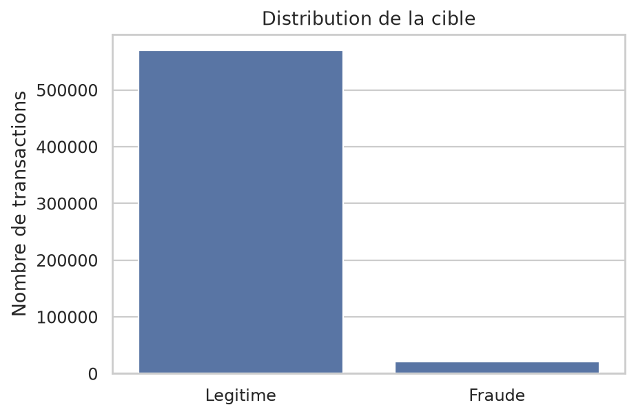
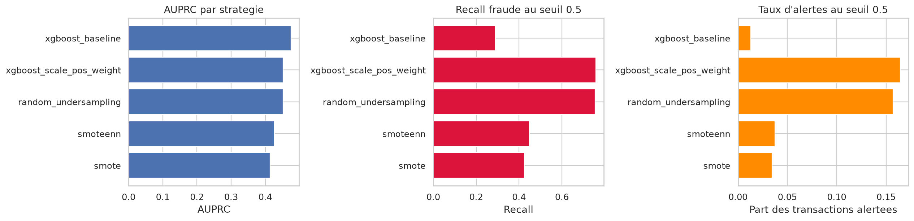
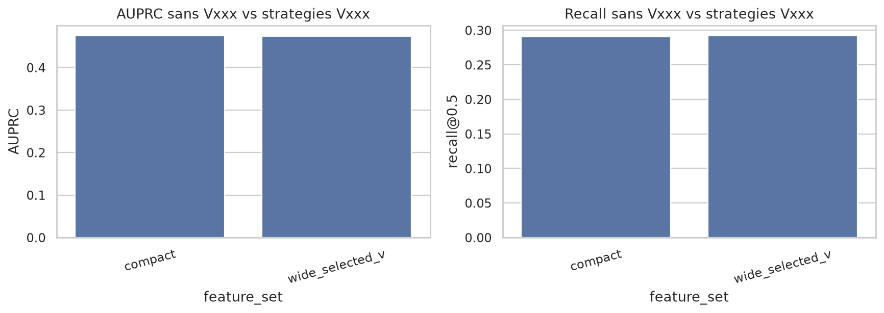
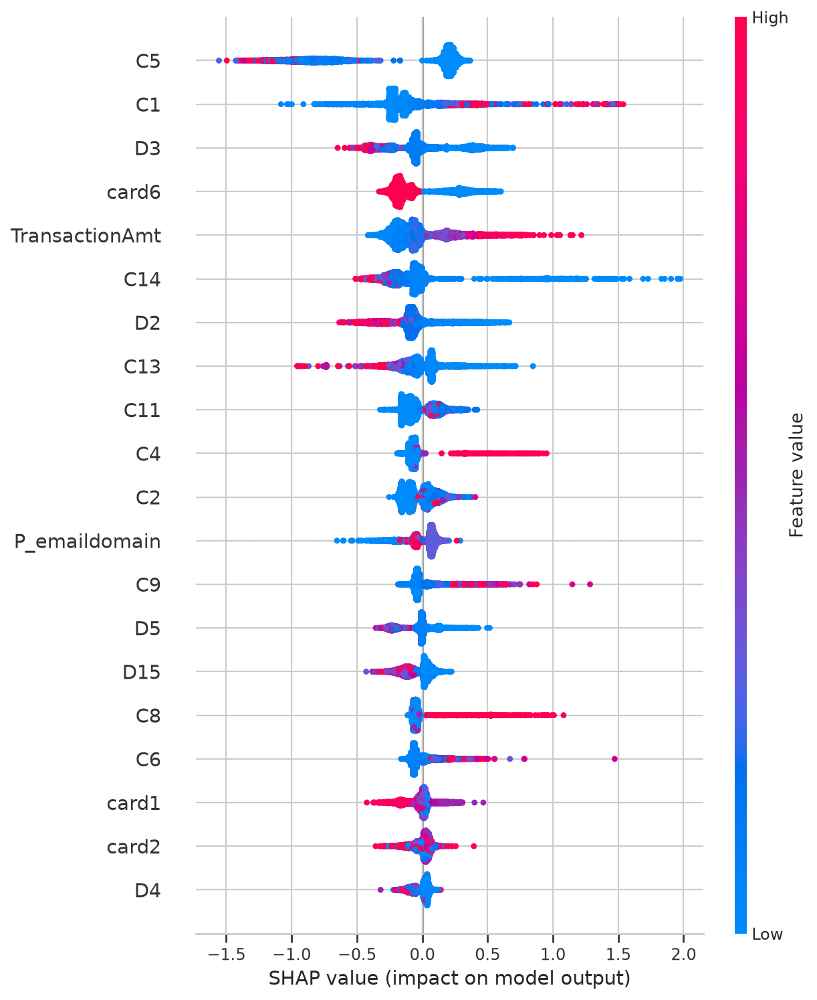
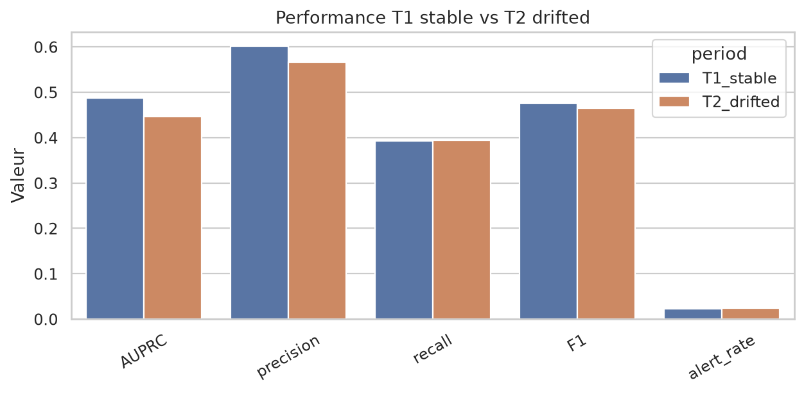
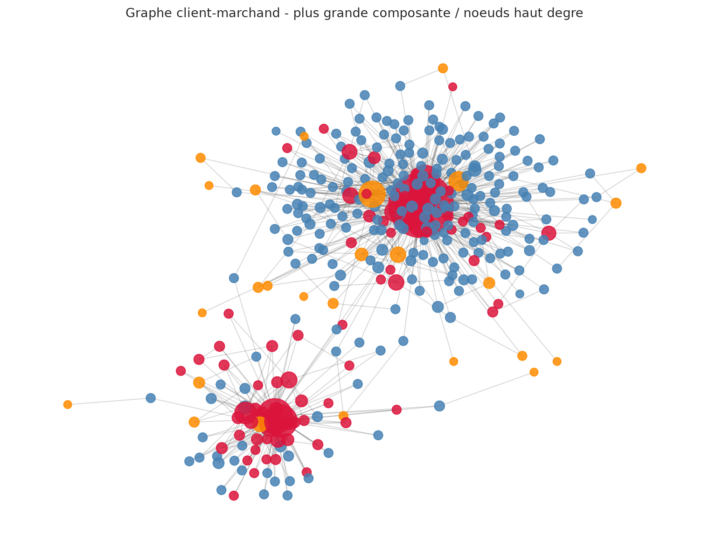
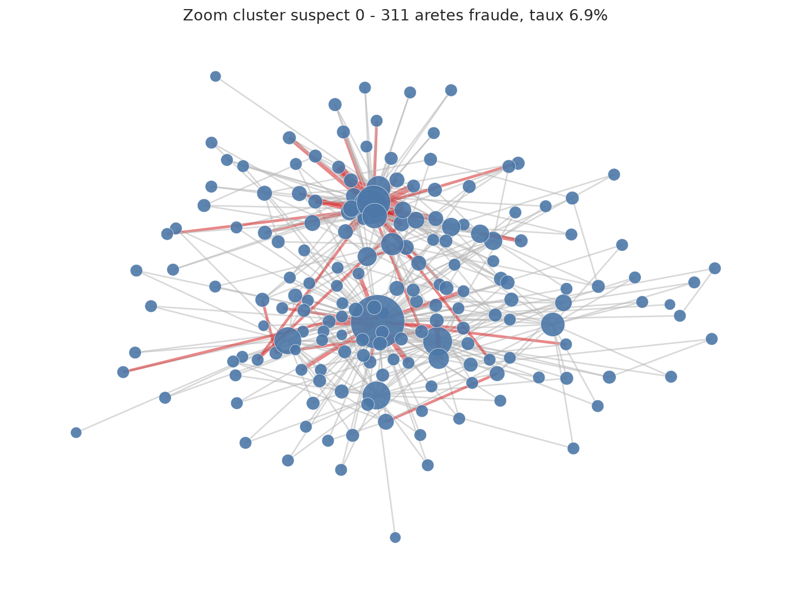
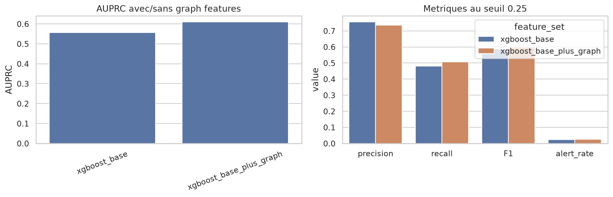
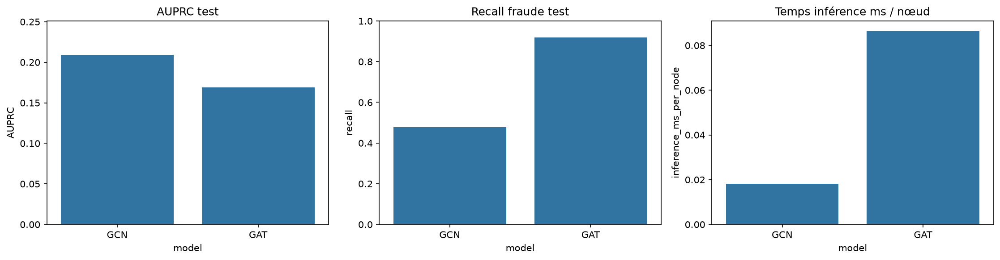

# Rapport final - Fraud Scope / PayTrack

## 1. Objectif du projet

Le projet vise à construire une démarche complète de détection de fraude pour PayTrack, depuis l'exploration des données jusqu'à la mise en production contrôlée d'un modèle.

Les questions principales sont :

- comment détecter des transactions frauduleuses dans un contexte fortement déséquilibré ;
- comment comparer correctement les modèles avec des métriques adaptées ;
- comment expliquer une décision de blocage à un analyste ;
- comment suivre les versions de modèles et éviter de casser la production ;
- comment détecter un drift après déploiement ;
- comment exploiter les structures de graphe, via NetworkX puis via GNN.

Le dataset principal est **IEEE-CIS Fraud Detection**. La partie GNN utilise **Elliptic Bitcoin Dataset**, qui est un dataset graphe séparé.

## 2. Organisation des notebooks

| Notebook | Rôle |
|---|---|
| `01_exploration_polars.ipynb` | EDA rapide avec Polars, analyse des classes, montants, temps, valeurs manquantes |
| `02_modelling.ipynb` | Features temporelles, resampling, XGBoost, comparaison des modèles |
| `03_explainability_shap.ipynb` | Explicabilité SHAP du meilleur XGBoost |
| `04_mlflow_tracking_registry.ipynb` | Tracking MLflow, runs, artefacts, validation gate, modèle candidat |
| `05_monitoring_drift_evidently.ipynb` | Simulation de monitoring, drift, performance T1/T2, alertes retraining |
| `06_graph_features_networkx.ipynb` | Graph features avec NetworkX sur 10 000 transactions |
| `07_gnn_elliptic_gcn_gat.ipynb` | GNN sur Elliptic : GCN vs GAT |

## 3. EDA et déséquilibre des classes

Le dataset IEEE-CIS contient environ **590 540 transactions**, dont **20 663 fraudes**, soit un taux de fraude d'environ **3.50 %**.

Ce déséquilibre rend l'accuracy peu fiable. Un modèle qui prédit toujours `non fraude` atteint déjà environ **96.5 % d'accuracy**, mais ne détecte aucune fraude. Les métriques utilisées dans la suite sont donc :

- **AUPRC**, métrique principale pour le classement des fraudes ;
- **recall fraude**, pour mesurer la capacité à capturer les fraudes ;
- **precision**, pour limiter les fausses alertes ;
- **F1**, compromis precision / recall ;
- **taux d'alertes**, important opérationnellement.



## 4. Modélisation tabulaire

Une baseline de régression logistique a d'abord été testée. Elle montre que le problème n'est pas résolu par un modèle simple : l'AUPRC reste faible et le recall fraude est limité.

Le modèle principal retenu est **XGBoost**, avec split temporel pour éviter une fuite d'information. Des stratégies de déséquilibre ont été comparées : baseline, `scale_pos_weight`, undersampling, SMOTE et SMOTEENN.

Résultats MLflow au seuil `0.25` :

| Stratégie | AUPRC | Precision | Recall | F1 | Taux alertes | Temps train |
|---|---:|---:|---:|---:|---:|---:|
| XGBoost baseline | 0.4753 | 0.5843 | 0.4129 | 0.4839 | 2.43 % | 9.36s |
| XGBoost scale_pos_weight | 0.4525 | 0.0723 | 0.9252 | 0.1342 | 44.01 % | 6.49s |
| Random undersampling | 0.4523 | 0.0787 | 0.8999 | 0.1448 | 39.33 % | 1.76s |
| SMOTEENN | 0.4265 | 0.1868 | 0.6572 | 0.2909 | 12.11 % | 132.85s |
| SMOTE | 0.4137 | 0.1959 | 0.6304 | 0.2989 | 11.07 % | 7.08s |

Le meilleur modèle en AUPRC est donc **XGBoost baseline**. Les méthodes qui maximisent le recall, comme `scale_pos_weight` ou l'undersampling, génèrent trop d'alertes pour être directement exploitables en production.



## 5. Features temporelles 1h / 24h / 7j

Le sujet demandait explicitement des features cumulées sur fenêtres temporelles. Elles ont été ajoutées dans le notebook de modélisation :

- nombre de transactions précédentes sur 1h, 24h et 7j ;
- montants cumulés sur 1h, 24h et 7j ;
- ratios et comportements client/marchand dérivés.

Ces features sont pertinentes métier : elles capturent les rafales d'activité, les montants anormalement élevés et les changements rapides de comportement.

Dans l'expérience compacte, leur gain sur l'AUPRC globale n'est pas massif. Cela ne signifie pas qu'elles sont inutiles : elles peuvent être importantes pour certains cas de fraude courts et pour l'explicabilité opérationnelle.

## 5 bis. Pertinence des colonnes Vxxx anonymisees

Les colonnes `Vxxx` sont anonymisees. Cela limite leur interpretation metier, mais elles restent pertinentes pour la prediction. Dans l'EDA, les plus fortes correlations avec `isFraud` sont principalement des `Vxxx`, ce qui indique qu'elles contiennent un signal fort.

Les resultats XGBoost principaux ont ete produits en mode `compact`, donc sans `Vxxx`. Le notebook permet maintenant de relancer une version `wide_selected_v` pour mesurer proprement leur apport.

Le choix recommande est progressif :

| Usage | Decision |
|---|---|
| Rapport et explication metier | garder un modele compact plus lisible |
| Recherche de performance | tester une selection des meilleures `Vxxx` |
| Production | documenter ces colonnes comme signaux anonymises et surveiller leur drift |

Je ne recommande pas d'ajouter toutes les `Vxxx` sans selection, car cela augmente la memoire, le temps d'entrainement et le risque de surapprentissage. Une selection de 20 a 50 colonnes `Vxxx` est un meilleur compromis.

Le notebook `02_modelling.ipynb` contient maintenant un mode dedie :

```python
FEATURE_SET = "wide_selected_v"
TOP_V_FEATURES = 50
```

Ce mode ajoute uniquement les meilleures colonnes `Vxxx`, selectionnees sur le train temporel.

Un troisieme mode a aussi ete ajoute :

```python
FEATURE_SET = "wide_v_blocks"
```

Il utilise les `Vxxx` representatives par blocs redondants issues du notebook de reference `eda-for-columns-v-and-id.ipynb`.

### Resultat de la comparaison compact vs Vxxx

Une comparaison directe a ete ajoutee dans `02_modelling.ipynb`.

| Feature set | Features | Vxxx | AUPRC | Recall@0.5 | F1@0.5 | Temps train | Gain AUPRC |
|---|---:|---:|---:|---:|---:|---:|---:|
| compact | 59 | 0 | 0.4753 | 0.2904 | 0.4206 | 13.98s | 0.0000 |
| wide_selected_v | 109 | 50 | 0.4734 | 0.2923 | 0.4250 | 24.15s | -0.0019 |



Conclusion : dans ce run, les `Vxxx` n'ameliorent pas l'AUPRC. Elles ameliorent tres legerement le recall et le F1 au seuil 0.5, mais elles rendent l'entrainement plus long. Le modele compact reste donc la reference principale pour le rapport final.

## 6. Explicabilité SHAP

SHAP a été utilisé pour expliquer le meilleur modèle XGBoost. Les livrables produits sont :

- beeswarm SHAP ;
- top 10 features ;
- explication d'une fraude correctement détectée ;
- explication d'un faux positif ;
- template d'explication en langage naturel.

Les features les plus importantes sont principalement des variables de comportement transactionnel et historique : `C5`, `C1`, `D3`, `card6`, `TransactionAmt`, `C14`, `D2`, `C13`, `C11`, `C4`.



Interprétation métier : SHAP permet à un analyste de comprendre pourquoi une transaction a été bloquée. Par exemple, une décision peut être expliquée par un montant atypique, un historique client inhabituel ou des compteurs transactionnels élevés.

## 7. MLflow et validation gate

MLflow a été mis en place avec une expérience `fraud-detection-paytrack`. Les runs enregistrent :

- paramètres du modèle ;
- AUPRC ;
- recall ;
- F1 ;
- temps d'entraînement ;
- courbes Precision-Recall ;
- matrices de confusion ;
- modèle candidat.

Une validation gate simule le passage en production. Elle vérifie notamment :

- AUPRC minimale ;
- recall minimal ;
- taux d'alertes maximal ;
- temps d'inférence maximal.

Cela répond à la question : **comment déployer une nouvelle version sans casser la production ?** La nouvelle version n'est promue que si elle respecte les contraintes de performance et d'exploitation.

## 8. Monitoring et drift

Le notebook monitoring simule deux périodes : T1 stable et T2 driftée.

| Période | AUPRC | Precision | Recall | F1 | Taux alertes |
|---|---:|---:|---:|---:|---:|
| T1 stable | 0.4873 | 0.6024 | 0.3933 | 0.4759 | 2.23 % |
| T2 driftée | 0.4464 | 0.5666 | 0.3934 | 0.4644 | 2.41 % |

La baisse relative d'AUPRC est de **8.40 %**, sous le seuil d'alerte de **15 %**. Le PSI maximal est **0.0033**, donc très faible. Le système ne déclenche pas de retraining immédiat.



Conclusion monitoring : la performance baisse légèrement, mais pas assez pour justifier un retraining automatique. Il faut continuer la surveillance.

## 9. Graph features avec NetworkX

Un graphe biparti a été construit sur **10 000 transactions** :

Le graphe biparti repose sur des proxys car le dataset ne fournit pas de vrai identifiant client ou marchand. `customer_proxy` combine `card1`, `card2`, `card3`, `card5` et `addr1`. `merchant_proxy` combine `ProductCD` et `R_emaildomain`. Ces proxys sont acceptables pour un POC, mais ils devront etre remplaces par de vrais identifiants tokenises en production.

- nœuds clients : `customer_proxy` ;
- nœuds marchands : `merchant_proxy` ;
- arêtes : transactions.

Résultats du graphe :

| Élément | Valeur |
|---|---:|
| Transactions | 10 000 |
| Nœuds | 4 119 |
| Arêtes | 4 501 |
| Composantes connexes | 14 |
| Taux fraude sous-graphe | 3.12 % |



Un cluster suspect important a été isolé : la composante 0 contient **4 088 nœuds**, **4 483 arêtes**, **311 arêtes frauduleuses** et un taux de fraude de **6.94 %**.



Les features graphe ajoutées sont :

- degré du compte client ;
- degré pondéré ;
- centralité betweenness ;
- nombre de marchands distincts sur 7 jours.

Comparaison XGBoost avec et sans graph features sur le sous-graphe :

| Modèle | AUPRC | Precision | Recall | F1 | Taux alertes | Gain AUPRC |
|---|---:|---:|---:|---:|---:|---:|
| XGBoost base | 0.5570 | 0.7551 | 0.4805 | 0.5873 | 2.45 % | 0.0000 |
| XGBoost + graph features | 0.6096 | 0.7358 | 0.5065 | 0.6000 | 2.65 % | +0.0526 |



Conclusion : les graph features apportent un signal complémentaire utile. L'AUPRC augmente de **+0.0526** sur le sous-graphe, avec un recall meilleur et un taux d'alertes encore raisonnable.

## 10. GNN sur Elliptic : GCN vs GAT

La partie GNN utilise **Elliptic Bitcoin Dataset**, chargé via PyTorch Geometric.

| Élément | Valeur |
|---|---:|
| Nœuds | 203 769 |
| Arêtes dans `edge_index` | 234 355 |
| Features par nœud | 165 |
| Nœuds train labellisés | 27 938 |
| Nœuds validation labellisés | 9 313 |
| Nœuds test labellisés | 9 313 |

Résultats :

| Modèle | AUPRC | Recall | Precision | F1 | Temps train | Inférence ms/nœud |
|---|---:|---:|---:|---:|---:|---:|
| GCN | 0.2091 | 0.4778 | 0.2146 | 0.2962 | 91.83s | 0.018188 |
| GAT | 0.1688 | 0.9197 | 0.0782 | 0.1441 | 156.75s | 0.086605 |



Le GAT obtient un recall beaucoup plus élevé, mais au prix d'une précision très faible et d'une AUPRC inférieure. Le GCN est donc meilleur selon l'AUPRC et plus rapide en inférence.

GAT peut théoriquement être supérieur à GCN parce qu'il apprend des poids d'attention entre voisins, au lieu d'agréger les voisins plus uniformément. Ici, cette flexibilité semble conduire à davantage de faux positifs.

## 11. Synthèse finale des modèles

| Famille | Dataset | Résultat principal | Conclusion |
|---|---|---|---|
| Régression logistique | IEEE-CIS | AUPRC faible | Baseline utile mais insuffisante |
| XGBoost baseline | IEEE-CIS | AUPRC 0.4753 | Meilleur choix principal PayTrack |
| XGBoost + resampling | IEEE-CIS | Recall élevé mais trop d'alertes | Utile pour analyse, pas meilleur candidat prod |
| XGBoost + graph features | Sous-graphe IEEE-CIS | AUPRC 0.6096, gain +0.0526 | Signal graphe intéressant à conserver |
| GCN | Elliptic | AUPRC 0.2091 | Meilleur GNN selon AUPRC |
| GAT | Elliptic | Recall 0.9197 | Très sensible mais trop de faux positifs |

## 12. Recommandation finale

Pour PayTrack, je recommande :

1. utiliser **XGBoost baseline** comme modèle principal ;
2. ajuster le seuil selon le coût métier des faux positifs et faux négatifs ;
3. conserver l'AUPRC comme métrique principale ;
4. utiliser SHAP pour justifier les décisions aux analystes ;
5. suivre les versions et les gates avec MLflow ;
6. surveiller drift, score moyen et AUPRC dans le temps ;
7. intégrer progressivement les graph features si elles confirment leur gain sur une validation plus large.

## 13. Limites

Les principales limites sont :

- les graph features NetworkX ont été validées sur un sous-graphe de 10 000 transactions, pas sur tout le dataset ;
- les GNN sont testés sur Elliptic, qui est un dataset différent du dataset PayTrack ;
- la validation gate utilise des seuils réalistes pour un POC, pas des seuils de production finale ;
- le coût métier exact des faux positifs et faux négatifs n'est pas connu ;
- les labels en production arriveraient probablement avec retard, ce qui complique le monitoring réel.

## 14. Conclusion générale

Le projet couvre l'ensemble de la chaîne attendue : exploration, modélisation, gestion du déséquilibre, explicabilité, tracking MLflow, monitoring drift, graph features et GNN.

Le modèle tabulaire XGBoost reste le meilleur candidat opérationnel pour PayTrack. Les graph features apportent un gain prometteur et constituent la piste la plus intéressante pour améliorer le modèle sans passer immédiatement à un GNN complet. Les GNN sont pertinents pour des données naturellement structurées en graphe comme Elliptic, mais leur intégration à PayTrack demanderait une modélisation graphe plus complète et une validation spécifique.
