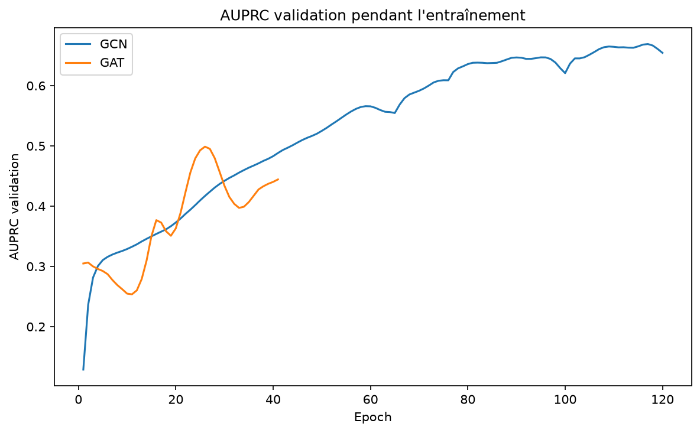

# Rapport - GNN sur Elliptic Bitcoin Dataset : GCN vs GAT

## Objectif

Cette expérience répond à la partie du sujet demandant de charger **Elliptic Bitcoin Dataset**, d'entraîner un **GCN**, d'entraîner un **GAT**, puis de comparer le **recall**, l'**AUPRC** et le **temps d'inférence**.

Le notebook associé est `notebooks/07_gnn_elliptic_gcn_gat.ipynb`.

## Dataset

| Élément | Valeur |
|---|---:|
| Source chargement | pyg |
| Nœuds | 203,769 |
| Arêtes dans `edge_index` | 234,355 |
| Features par nœud | 165 |
| Nœuds train labellisés | 27,938 |
| Nœuds validation labellisés | 9,313 |
| Nœuds test labellisés | 9,313 |

Les nœuds non labellisés restent dans le graphe pour conserver l'information de voisinage, mais ils ne sont pas utilisés dans la loss ni dans les métriques.

## Résultats

| Modèle | AUPRC | Recall | Precision | F1 | Temps train | Inférence ms/nœud |
|---|---:|---:|---:|---:|---:|---:|
| GCN | 0.2091 | 0.4778 | 0.2146 | 0.2962 | 91.83s | 0.018188 |
| GAT | 0.1688 | 0.9197 | 0.0782 | 0.1441 | 156.75s | 0.086605 |

## Analyse

Le meilleur modèle selon l'AUPRC est **GCN**, avec une AUPRC de **0.2091**.

Comparaison GAT - GCN :

| Écart | Valeur |
|---|---:|
| Delta AUPRC | -0.0403 |
| Delta recall | +0.4419 |
| Delta inférence ms/nœud | +0.068417 |

GCN est meilleur ou équivalent en AUPRC sur ce run.

## Pourquoi GAT peut être supérieur à GCN

Un **GCN** agrège les informations des voisins avec une pondération principalement liée à la structure du graphe. Cela revient souvent à lisser les représentations locales. Sur un graphe de transactions, ce lissage peut être utile, mais il peut aussi diluer le signal de fraude si un nœud est connecté à beaucoup de voisins peu informatifs.

Un **GAT** apprend au contraire des poids d'attention entre voisins. Il peut donc donner plus d'importance aux voisins ou relations qui portent un signal suspect, et moins d'importance aux voisins ordinaires. C'est particulièrement pertinent pour Elliptic, car les comportements illicites peuvent être localisés dans certaines zones du graphe et ne pas être uniformément répartis.

La contrepartie est que GAT est souvent plus coûteux en calcul : il doit estimer des coefficients d'attention par arête, parfois avec plusieurs têtes d'attention. C'est pourquoi il faut comparer non seulement l'AUPRC et le recall, mais aussi le temps d'inférence.

## Conclusion

Cette expérience couvre la partie GNN demandée par le sujet : chargement Elliptic, entraînement GCN, entraînement GAT, comparaison Recall/AUPRC/temps d'inférence et interprétation de la différence entre les deux architectures.
