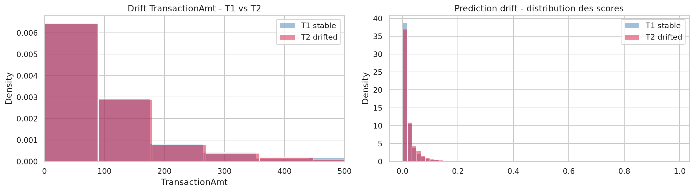

# Rapport Monitoring Drift - Evidently

## Objectif

Cette partie repond a la question du CDO :

> Comment saurai-je que le modele se degrade dans 3 mois ?

Le notebook `05_monitoring_drift_evidently.ipynb` met en place un scenario de monitoring en production avec :

- un decoupage temporel T0 / T1 / T2 ;
- une simulation de drift sur T2 ;
- une comparaison de performance entre T1 et T2 ;
- des rapports HTML Evidently ;
- des seuils d'alerte de retraining.

## 1. Methode

Le dataset est decoupe selon l'ordre temporel :

| Periode | Role | Description |
|---|---|---|
| T0 | Entrainement | donnees historiques utilisees pour entrainer le modele |
| T1 | Production stable | periode de reference pour le monitoring |
| T2 | Production drifted | periode simulee avec evolution des patterns frauduleux |

Le modele XGBoost est entraine sur T0. Il est ensuite evalue sur T1 et T2.

Le drift est simule en modifiant une partie des fraudes de T2 pour les transformer en micro-transactions de faible montant. Cette simulation represente une tactique plausible : des fraudeurs fragmentent les montants pour passer sous les seuils classiques.

## 2. Artefacts generes

Les rapports Evidently ont ete generes dans :

- [`evidently_reports/data_drift_report.html`](../evidently_reports/data_drift_report.html)
- [`evidently_reports/model_performance_report.html`](../evidently_reports/model_performance_report.html)
- [`evidently_reports/prediction_drift_report.html`](../evidently_reports/prediction_drift_report.html)

Les fichiers de synthese sont :

- `docs/monitoring_drift_summary.json`
- `docs/monitoring_performance.csv`
- `docs/monitoring_psi.csv`

## 3. Drift des donnees et des scores

Le premier graphe compare la distribution de `TransactionAmt` et celle des scores de fraude entre T1 et T2.



Observation : la distribution des montants et des scores reste visuellement proche entre T1 et T2. La simulation de drift existe, mais elle n'est pas assez massive pour deplacer fortement toute la distribution globale.

C'est un point important : un drift fraude peut etre reel tout en etant peu visible dans la distribution globale, car la fraude reste minoritaire. Il faut donc surveiller a la fois les features, les scores et les performances labelisees avec retard.

## 4. Performance T1 vs T2

| Periode | AUPRC | Precision | Recall | F1 | Taux alertes | Score moyen | Score P95 |
|---|---:|---:|---:|---:|---:|---:|---:|
| T1 stable | 0.4873 | 0.6024 | 0.3933 | 0.4759 | 2.23 % | 0.0355 | 0.1140 |
| T2 drifted | 0.4464 | 0.5666 | 0.3934 | 0.4644 | 2.41 % | 0.0380 | 0.1251 |


La performance baisse entre T1 et T2 :

- AUPRC : **0.4873 -> 0.4464** ;
- baisse relative AUPRC : **8.40 %** ;
- precision : **0.6024 -> 0.5666** ;
- recall : stable, environ **0.393** ;
- F1 : **0.4759 -> 0.4644** ;
- taux d'alertes : **2.23 % -> 2.41 %**.

Analyse : le modele se degrade, mais la degradation reste moderee. L'AUPRC baisse, ce qui signifie que le classement des transactions par risque est moins bon. En revanche, le recall au seuil choisi reste stable.

Mon avis : ce resultat est realiste. Le drift simule affecte la qualite du scoring, mais pas assez pour justifier automatiquement un retraining selon les seuils definis.

## 5. PSI sur features critiques

Le PSI a ete calcule sur plusieurs features critiques :

| Feature | PSI |
|---|---:|
| TransactionAmt | 0.0033 |
| amt_to_customer_mean_prev | 0.0026 |
| customer_tx_count_prev_1h | 0.0022 |
| customer_amt_sum_prev_24h | 0.0018 |
| customer_amt_sum_prev_7d | 0.0013 |

Tous les PSI sont tres faibles, bien en dessous du seuil **0.2**.

Interpretation : selon le PSI, il n'y a pas de drift significatif sur les features critiques selectionnees. Cela peut sembler contradictoire avec la simulation, mais c'est coherent : la fraude est minoritaire, donc modifier seulement une partie des fraudes peut ne pas suffire a faire bouger la distribution globale d'une feature.

Mon avis : pour un vrai systeme antifraude, il faudrait aussi calculer le PSI sur des sous-populations : transactions scorees a haut risque, transactions refusees, marchands sensibles, ou transactions suspectes. Le drift fraude peut etre invisible dans une analyse globale.

## 6. Decision de retraining

Les seuils d'alerte configures sont :

| Signal | Seuil |
|---|---:|
| Chute relative AUPRC | > 15 % |
| Shift moyen des scores | > 20 % |
| PSI feature critique | > 0.2 |

Resultats observes :

| Signal | Valeur | Alerte |
|---|---:|---|
| AUPRC T1 | 0.4873 | - |
| AUPRC T2 | 0.4464 | - |
| Chute AUPRC | 8.40 % | Non |
| Score moyen T1 | 0.0355 | - |
| Score moyen T2 | 0.0380 | - |
| Shift score moyen | 7.23 % | Non |
| PSI max | 0.0033 | Non |

Decision finale : **pas d'alerte de retraining automatique**.

Le fichier `monitoring_drift_summary.json` indique :

```json
{
  "AUPRC_drop_alert": false,
  "score_shift_alert": false,
  "PSI_alert": false,
  "retraining_alert": false
}
```

## 7. Reponse a la question CDO

A la question :

> Comment saurai-je qu'il se degrade dans 3 mois ?

La reponse proposee est :

> Le modele sera surveille via trois familles de signaux : la derive des donnees, la derive des scores et la performance mesuree sur labels retardes. Une alerte de retraining sera declenchee si l'AUPRC chute de plus de 15 %, si le PSI depasse 0.2 sur une feature critique, ou si la moyenne des scores de fraude derive de plus de 20 %.

Dans la simulation actuelle, le modele montre une degradation moderee : l'AUPRC baisse de **8.40 %**, mais cela reste sous le seuil d'alerte de **15 %**. Le systeme recommande donc de continuer la surveillance, sans retraining immediat.

## 8. Limites

Cette simulation a plusieurs limites :

- le drift est artificiel ;
- la fraude est rare, donc une derive sur les fraudes peut etre masquee dans les distributions globales ;
- le PSI global peut ne pas detecter une derive localisee ;
- les labels de fraude arrivent souvent avec retard en production ;
- il faudrait surveiller des segments metier : marchand, produit, device, pays, type de carte, score eleve.

## 9. Recommandations

Pour une version production PayTrack :

1. Monitorer quotidiennement la distribution des scores.
2. Monitorer chaque semaine les PSI sur features critiques.
3. Monitorer les performances des que les labels de chargeback arrivent.
4. Declencher une alerte si AUPRC chute de plus de 15 %.
5. Declencher une alerte si PSI > 0.2 sur une feature critique.
6. Declencher une revue analyste si le taux d'alertes augmente fortement.
7. Ajouter un monitoring segmente sur les transactions haut risque.

Conclusion : le systeme de monitoring est en place et permet de detecter une degradation avant qu'elle ne devienne critique. Dans ce test, la degradation existe mais reste sous les seuils de retraining.
