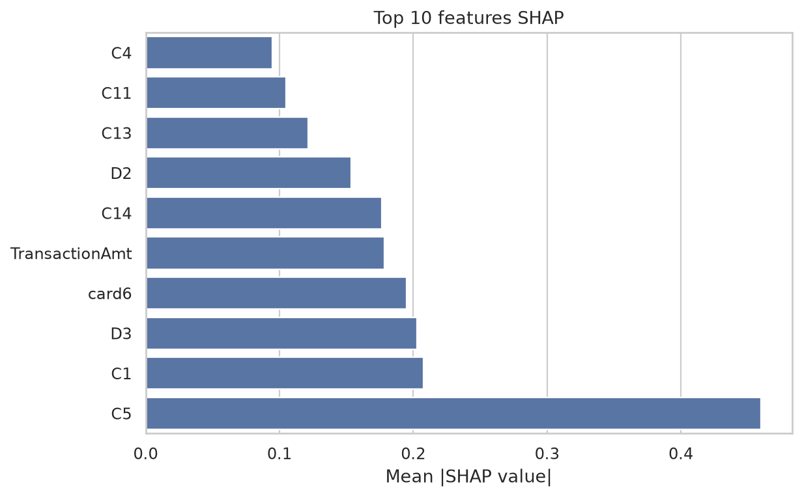
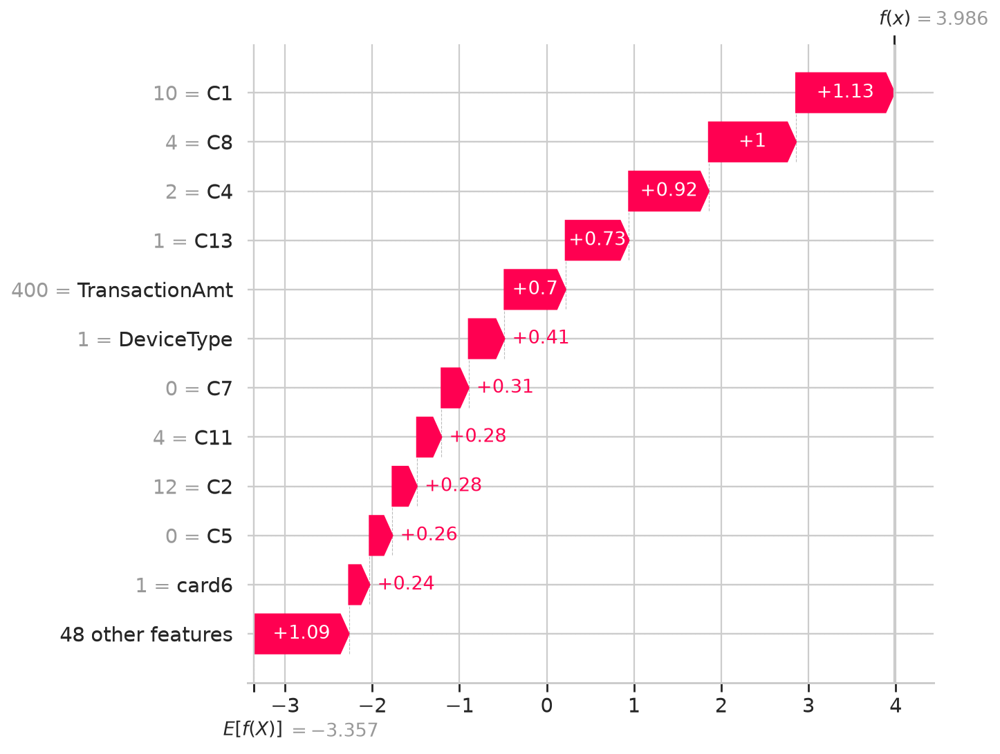
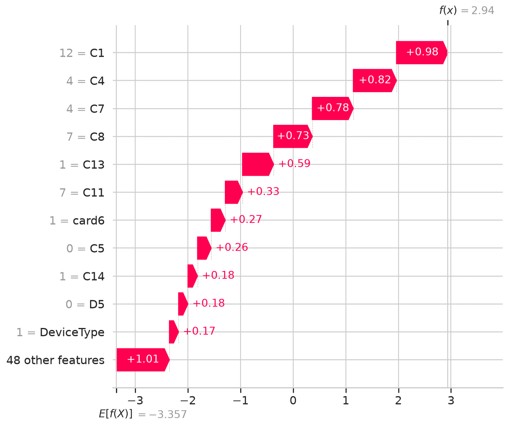

# Rapport SHAP - Explicabilite du modele fraude

## Objectif

Cette partie repond a la question du CDO :

> Comment un analyste peut-il comprendre pourquoi une transaction est bloquee ?

L'objectif n'est pas seulement de produire un score de fraude, mais de donner une explication lisible pour chaque decision. Pour cela, le notebook `03_explainability_shap.ipynb` utilise SHAP sur le meilleur modele actuel : **XGBoost baseline**.

Les artefacts utilises sont :

- `docs/assets/03_shap_beeswarm.png`
- `docs/assets/03_shap_top10_features.png`
- `docs/assets/03_shap_waterfall_fraude_correctement_detectee.png`
- `docs/assets/03_shap_waterfall_faux_positif.png`
- `docs/shap_explanations_summary.csv`

## 1. Methode

Le modele explique est le modele **XGBoost baseline**, entraine sur le dataset compact enrichi avec les features temporelles :

- historique client global ;
- ratio montant / moyenne historique ;
- indicateur nouveau marchand ;
- fenetres 1h, 24h et 7 jours ;
- variables transactionnelles et categorielles principales.

SHAP est calcule sur un echantillon de validation. Les valeurs SHAP indiquent comment chaque feature pousse la prediction :

- valeur SHAP positive : la feature augmente le score de fraude ;
- valeur SHAP negative : la feature reduit le score de fraude.

Important : les waterfall plots SHAP affichent l'impact sur la sortie brute du modele XGBoost, proche d'une echelle log-odds. Le score metier communique a l'analyste reste le score de fraude probabiliste.

## 2. Importance globale des features

Le beeswarm SHAP montre les variables qui influencent le plus les predictions sur l'echantillon de validation.

Le top 10 SHAP est domine par :

| Rang | Feature | Interpretation |
|---:|---|---|
| 1 | `C5` | Compteur anonymise tres structurant pour le modele |
| 2 | `C1` | Compteur anonymise fortement lie au risque |
| 3 | `D3` | Variable temporelle/historique anonymisee |
| 4 | `card6` | Type de carte, notamment credit/debit |
| 5 | `TransactionAmt` | Montant de la transaction |
| 6 | `C14` | Compteur anonymise |
| 7 | `D2` | Variable temporelle/historique anonymisee |
| 8 | `C13` | Compteur anonymise |
| 9 | `C11` | Compteur anonymise |
| 10 | `C4` | Compteur anonymise |

Analyse : le modele ne s'appuie pas seulement sur le montant. Il donne beaucoup de poids aux variables de type `C*`, qui semblent capturer des comportements de frequence, de comptage ou d'historique transactionnel. C'est coherent pour un probleme de fraude : les signaux forts viennent souvent de comportements repetes ou inhabituels, pas d'une seule variable brute.

Mon avis : c'est un bon point pour le projet, car l'explication globale est metier-compatible. En revanche, plusieurs variables sont anonymisees (`C1`, `C5`, `D3`, etc.), donc elles sont moins faciles a presenter a un analyste non technique. Pour une vraie production, il faudrait documenter leur signification exacte ou les remplacer par des features metier nommees.

## 3. Cas 1 - Fraude correctement detectee

Le notebook a selectionne une fraude correctement detectee :

| Element | Valeur |
|---|---:|
| TransactionID | 3569809 |
| Label reel | Fraude |
| Score fraude | 98.2 % |
| Decision au seuil 0.25 | Bloquee / envoyee a analyse |

Les principaux facteurs qui augmentent le score sont :

| Feature | Valeur | Effet |
|---|---:|---|
| `C1` | 10.00 | augmente le score de fraude |
| `C8` | 4.00 | augmente le score de fraude |
| `C4` | 2.00 | augmente le score de fraude |

Les principaux facteurs qui attenuent le risque sont :

| Feature | Valeur | Effet |
|---|---:|---|
| `card1` | 14671 | reduit le score |
| `D2` | manquant | reduit le score |
| `C9` | 0.00 | reduit le score |

Lecture analyste : cette transaction est bien une fraude et le modele lui attribue un score tres eleve. L'explication locale montre que plusieurs compteurs comportementaux (`C1`, `C8`, `C4`, `C13`) poussent fortement le score vers la fraude. Le montant de transaction contribue aussi au risque dans le waterfall.

Explication metier generable :

> Transaction 3569809 : le modele estime un score de fraude de 98.2 %. La transaction est etiquetee comme frauduleuse dans le dataset et serait bloquee au seuil 0.25. Les principaux facteurs de risque sont C1=10.00, C8=4.00 et C4=2.00, qui augmentent fortement le score. Certains facteurs comme card1=14671, D2 manquant et C9=0.00 attenuent le risque, mais pas assez pour compenser les signaux frauduleux.

Mon avis : c'est un bon exemple de decision explicable. L'analyste voit que le blocage n'est pas uniquement lie au montant, mais a une combinaison de signaux comportementaux.

## 4. Cas 2 - Faux positif

Le notebook a aussi selectionne un faux positif : une transaction legitime que le modele aurait bloquee au seuil metier.

| Element | Valeur |
|---|---:|
| TransactionID | 3569136 |
| Label reel | Legitime |
| Score fraude | 95.0 % |
| Decision au seuil 0.25 | Bloquee / envoyee a analyse |

Les principaux facteurs qui augmentent le score sont :

| Feature | Valeur | Effet |
|---|---:|---|
| `C1` | 12.00 | augmente le score de fraude |
| `C4` | 4.00 | augmente le score de fraude |
| `C7` | 4.00 | augmente le score de fraude |

Les principaux facteurs qui attenuent le risque sont :

| Feature | Valeur | Effet |
|---|---:|---|
| `TransactionAmt` | 31.85 | reduit le score |
| `C9` | 0.00 | reduit le score |
| `card2` | 545.00 | reduit le score |

Lecture analyste : le faux positif ressemble fortement a une fraude du point de vue des compteurs comportementaux. Les variables `C1`, `C4`, `C7`, `C8` et `C13` poussent le score vers la fraude. Le montant faible attenue le risque, mais pas suffisamment.

Explication metier generable :

> Transaction 3569136 : le modele estime un score de fraude de 95.0 %. La transaction est pourtant legitime dans le dataset, mais serait bloquee au seuil 0.25. Le modele l'a consideree risquee principalement a cause de C1=12.00, C4=4.00 et C7=4.00. Le montant faible, TransactionAmt=31.85, reduit le risque, mais les compteurs comportementaux dominent la decision.

Mon avis : ce faux positif est tres instructif. Il montre que le modele peut surreagir a des patterns comportementaux proches de la fraude, meme quand le montant est faible. Pour la production, il faudrait surveiller ces faux positifs et peut-etre ajouter une regle d'arbitrage ou un seuil different selon le segment.

## 5. Template d'explication pour analyste fraude

Un template simple peut etre utilise pour transformer les contributions SHAP en phrase lisible :

> Cette transaction a ete bloquee car le modele lui attribue un score de fraude de `{score}`. Les principaux facteurs qui augmentent le risque sont `{feature_1}={value_1}`, `{feature_2}={value_2}` et `{feature_3}={value_3}`. Les facteurs qui attenuent le risque sont `{feature_4}={value_4}` et `{feature_5}={value_5}`. Cette explication est basee sur les contributions SHAP locales de la transaction.

Version orientee PayTrack :

> Cette transaction a ete envoyee a analyse car son score de fraude est de `{score}`. Le score est principalement explique par des signaux comportementaux inhabituels : `{risk_factor_1}`, `{risk_factor_2}`, `{risk_factor_3}`. Certains elements reduisent le risque, notamment `{mitigating_factor_1}` et `{mitigating_factor_2}`, mais ils ne suffisent pas a faire passer la transaction sous le seuil de blocage `{threshold}`.

## 6. Conclusion

SHAP permet de repondre clairement a la question du CDO : un analyste peut comprendre pourquoi une transaction est bloquee en regardant les principales contributions positives et negatives.

Les resultats montrent que :

- le modele s'appuie surtout sur des variables comportementales et historiques (`C*`, `D*`) ;
- `TransactionAmt`, `card6`, `card1`, `card2` et `P_emaildomain` jouent aussi un role ;
- une fraude correctement detectee est expliquee par une accumulation de signaux comportementaux a risque ;
- un faux positif peut avoir un profil tres proche d'une fraude sur ces memes compteurs ;
- l'explication locale est utile pour l'analyste, mais certaines features anonymisees restent difficiles a interpreter sans dictionnaire metier.

Recommandation : conserver SHAP dans le pipeline final et exposer pour chaque transaction bloquee :

1. le score de fraude ;
2. les 3 facteurs qui augmentent le plus le risque ;
3. les 2 facteurs qui reduisent le plus le risque ;
4. une phrase d'explication generee automatiquement ;
5. un lien vers les transactions similaires ou l'historique client si cette partie est implementee plus tard.

Limite importante : pour une vraie mise en production, les features anonymisees `C*` et `D*` doivent etre documentees ou remplacees par des noms metier plus explicites. Sinon, l'explication est techniquement correcte mais moins actionnable pour un analyste non data scientist.
