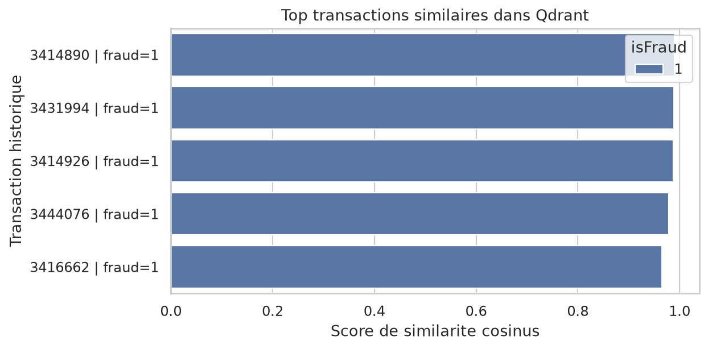

# Rapport - Recherche de transactions similaires avec SHAP + Qdrant

## Objectif

Cette partie répond à l'option du sujet : retrouver, pour une transaction suspecte, les 5 transactions historiques les plus similaires.

## Méthode

- Modèle utilisé : XGBoost compact.
- Embedding : SHAP values de chaque transaction.
- Index vectoriel : Qdrant local.
- Distance : cosinus.
- Historique indexé : 50,000 transactions train.
- Requête : transaction de validation `TransactionID=3504601`, score fraude `0.9852`.

## Résultat

Les 5 voisins les plus similaires sont sauvegardés dans `docs/similarity_search_results.csv`.

## Lecture analyste

Le taux de fraude parmi les voisins est `100.00%`. L'analyste peut comparer les montants, produits, cartes, emails, devices et top SHAP features pour vérifier si la transaction suspecte appartient à un pattern déjà observé.

## Limites

L'index est limité à `50,000` transactions pour garder une démo locale raisonnable. Une version production devrait indexer tout l'historique passé, mettre à jour Qdrant en continu et tracer les requêtes analystes.
